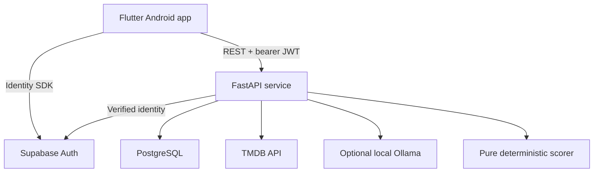

# Cinemé — architecture

Version 1.1. A small modular monolith with explicit integration boundaries.

## System shape



The app talks directly to Auth for identity and to TMDB's image CDN for posters. All movie-data API calls, ranking and application database operations go through FastAPI. No client Supabase database calls. No public AI endpoint.

## Architecture decisions

| ID | Decision | Why | Tradeoff |
|---|---|---|---|
| A01 | FastAPI modular monolith | One deployable, easy local debugging and shared transactions | Modules require disciplined imports; no independent scaling |
| A02 | Synchronous SQLAlchemy 2, psycopg 3 and HTTPX clients; `def` routes | Straightforward transactions and tests; FastAPI dispatches synchronous handlers through its threadpool | Bound pools and timeouts; do not mix blocking calls into async handlers |
| A03 | PostgreSQL, Alembic migrations | Constraints, locking, JSON snapshots and reproducible schema | Docker Desktop required for local integration tests |
| A04 | Supabase Auth, asymmetric ES256 signing keys | Avoid maintaining credentials/refresh-token issuance | Hosted identity dependency; verify actual project signing configuration |
| A05 | Riverpod without code generation, go_router | Manage async screens, dependencies and auth routing with few concepts | A modest dependency footprint; avoid Bloc plus Riverpod mixtures |
| A06 | Immutable typed boundaries, feature repositories, thin services | UI and engine are independently testable | Some DTO conversion; no universal repository framework |
| A07 | Deterministic scorer and templates | Auditable decisions, reliable explanations | No inferred nuanced taste or generated narration in V1 |
| A08 | Optional Ollama context parser and disabled provider | Local experimentation, LLM-independent product | Host latency/hardware varies; exact model selected by measured evaluation |
| A09 | Backend TMDB adapter; internal identity is TMDB movie ID | Legal documented data source, prevents duplicate films | V1 is metadata-provider-specific; future sources resolve into that identity |
| A10 | PostgreSQL metadata cache; no Redis or queue | Existing stack suffices at V1 size | Refresh is explicit; no continuous catalogue freshness job |
| A11 | Daily sessions plus bounded winner/comparison evidence | Stable choice, clear reasons and inspectable top comparisons | Full production candidate-set replay intentionally not retained |

## Repository layout

```text
cineme/
  CLAUDE.md and planning documents
  frontend/
    lib/ test/ integration_test/ pubspec.yaml pubspec.lock
  backend/
    app/
      main.py
      core/       # settings, db, errors, logging, auth, clock, rate limits
      users/      # profile/preferences/blocks
      movies/     # metadata service and TMDB adapter
      watchlist/  # ingestion commands and watchlist service
      recommendations/ # session service, scorer, reasons, versioned config
      viewing/    # watched records and rating service
      context/    # context validation and deterministic time parsing
      ai/         # context provider protocol + disabled/Ollama adapters
    tests/unit/ tests/integration/ tests/contracts/
    data/movie_traits.v1.json # optional enrichment, not required to run
    config/recommendation_weights.v1.json
    migrations/
    pyproject.toml uv.lock
    Dockerfile
  infra/compose.yaml
  scripts/       # Windows-friendly documented maintenance/seed commands
  docs/adr/      # accepted decisions and approved deviations
  .github/workflows/ci.yml
```

Each feature may have `router.py`, `schemas.py`, `models.py`, `service.py` only when it needs them. Do not create empty layers. Shared SQLAlchemy registry supports feature models. Prefer explicit SQLAlchemy queries inside feature services over generic CRUD repositories. The engine cannot import ORM models.

## Frontend/backend ownership

Frontend owns rendering, form validation for usability, context proposal review, session-scoped state and auth SDK integration. It does not score, infer taste or hold TMDB/LLM/database credentials.

Backend owns authoritative validation, JWT verification, ownership checks, relational mutations, metadata normalization, scoring, reason generation, accepted context, snapshots and API error mapping. Flutter models reflect domain meaning but do not duplicate backend learning logic.

Database owns unique keys, referential integrity, checks and atomic writes. It is not a recommendation engine; no scoring stored procedures.

## Authentication and authorization

1. Flutter signs up/signs in using `supabase_flutter`; email verification and password recovery are supported. The SDK manages refresh.
2. Each API request contains the access JWT, never a user-supplied user ID.
3. FastAPI validates signature against configured project JWKS, exact issuer `https://<project-ref>.supabase.co/auth/v1`, audience `authenticated`, ES256 allowlist, `exp`, `iat`, `sub`, and `nbf` when present, with at most 30 seconds leeway. Require `sub` to parse as UUID, nonempty signed `email`, role `authenticated`, and no anonymous identity. Do not infer authentication from merely decoding a JWT or trusting `user_metadata`.
4. Require email confirmation in the Auth project. Before first bootstrap, call the provider's validated get-user endpoint outside any DB transaction using the access token and backend-configured publishable key. Require returned ID=sub and non-null `email_confirmed_at`, and reject deleted/banned users. Then create `users.id = JWT sub` and preferences idempotently. Existing profiles use signed JWT verification on ordinary requests; they do not require an identity-network call every time. The application stores no password/hash/refresh token and does not trust email from request bodies.
5. Every private query has a user scope. Resource lookup for another owner returns 404, not a leaked 403. Test with two real test identities and synthetic unit tokens.

Use PyJWT with cryptography and one small verifier module. Use the library's maintained signature/JWKS functionality rather than a custom JWT/security framework. Configure trusted project URL/ES256/issuer/audience and bounded network timeout2s; use its supported JWKS cache behavior with five-minute freshness, tested against the pinned version. Unknown/rotated keys may refresh once; inability to retrieve a valid trusted key ->503, invalid signature/claims ->401. Never trust token-supplied jku/algorithm. Keep minimal synchronization/rate protection where library use needs it, not a bespoke revocation/key-management service. Test wrong issuer/audience, forged/expired token, key rotation and identity isolation; Supabase retains responsibility for credentials, sessions, verification and recovery.

Bootstrap and JWT verification are distinct from authorization. Application endpoints use the backend DB role, never the user's token for database access. Put app tables in `cineme` schema; revoke privileges on it from `anon` and `authenticated`; exclude it from Supabase's exposed Data API schemas. Backend uses a dedicated least-privilege role; migrations use a separate role. If deployed elsewhere, the same grants apply. RLS is optional later defense in depth, not a substitute for server ownership checks.

Flutter calls POST `/me/bootstrap` after obtaining a session, then read-only GET `/me`, before showing the private shell. Other app endpoints require an existing profile and return 409 `PROFILE_NOT_INITIALIZED` if absent; they do not secretly bootstrap another user. Bootstrap provider unavailability returns 503, and an unverified email returns 403 `EMAIL_NOT_VERIFIED`. Startup UI offers retry and preserves the signed-in SDK session on an infrastructure error.

Normal development uses a separate hosted Auth project and local PostgreSQL. Tests use dependency overrides/JWT fixtures and local PostgreSQL; no network provider required. No `AUTH_DISABLED` runtime switch. Stub identity code lives in tests only. Configure access-token lifetime to 15 minutes: logout/revocation can invalidate refresh immediately but an already-issued access JWT remains usable until expiry. A live revocation list is outside V1. Auth email delivery/redirect restrictions must be checked in the actual dev project; configure SMTP for staging if its built-in email service cannot serve both owned test accounts.

## Pure recommendation boundary

`rank(input: RankingInput, config: EngineConfig) -> RankingResult` accepts plain validated immutable values: candidate movies, watchlist dates, trait provenance, confirmed desired experience/optional emotion/context, computed genre affinities, previous watched genre sets, last offer times, exclusions, and an explicit UTC evaluation time. Returns eligible/excluded records, normalized components, weighted contributions, reasons and winner ID or no match.

Service computes/loads profile affinity and candidate state, but mathematical helper functions remain pure and unit-tested. No LLM-generated tags or scores. Engine config validates nonnegative weights totaling exactly 100 and supported versions. Algorithm changes require a new engine version. Weight/intent-map changes require config versions/hash. Optional retained trait values carry review source/version; the curated dataset is never a startup requirement.

## Provider boundaries

### Movie metadata

`MovieMetadataProvider.search(query, page)` and `get_details(tmdb_id)` return internal DTOs. Implement only `TmdbMovieMetadataProvider`. HTTPX handles bearer read-access token, fixed HTTPS base URL, `en-US`, bounded timeouts and schema mapping. Search result runtime is optional until details are fetched; do not fake it. `include_adult=false`, and verify details again when adding.

Search does not populate the entire database. Adding or logging a watch fetches/upserts details, or uses valid cached details, then invokes the internal ingestion/viewing command. Poster URLs are built from TMDB configuration, allowed HTTPS host and vetted path. Client-supplied URLs are never fetched by the server.

`WatchlistService.add(user_id, ResolvedMovie(tmdb_id), provenance)` is the common entry point for manual adds and later import adapters. A future `WatchlistSourceAdapter.parse(file_bytes)` emits normalized references; resolver maps them to TMDB identities; preview exposes ambiguity; commit calls the same command. Source metadata is not an ownership or authentication mechanism.

Future CSV design (not a V1 endpoint): Cinemé format `tmdb_id,title,year`, with an exact TMDB ID preferred; title/year-only rows require candidate matching and explicit user resolution if multiple matches exist. A Letterboxd export adapter maps actual exported headers into these references after inspecting sample files; Letterboxd URLs are opaque references, not instructions to scrape. Preview reports duplicates, unmatched rows, watched/blocked conflicts and quota impact before commit. Use bounded UTF-8 CSV bytes (proposed 5MiB/500 rows), no arbitrary URL fetches, no executable formulas, no archive extraction by default. Imported dates do not silently backdate watchlist age. This extension reuses metadata resolution and add commands rather than bypassing constraints. Import/source-job tables are added only when the feature is authorized.

### Context AI

`ContextProvider.parse(text, schema) -> ContextProposal` plus capability/health metadata. Implement `DisabledContextProvider` and `OllamaContextProvider`. Configuration selects the adapter at startup. A future cloud adapter must pass the same contract tests and privacy review; no provider-specific fields enter domain/API models.

Use Ollama native `/api/chat` with `stream=false`, JSON schema in `format`, bounded output, temperature zero, timeout 15 seconds. Schema conformance is not semantic correctness. Local validation, explicit numeric time extraction, unknown-field rejection, allowed genre IDs and a user review step remain mandatory. No tool calling, conversation memory or movie candidates in the prompt. Treat user text as data, not executable instruction. Do not call the provider from the scorer.

V1 explanation templates use structured reasons. Provider interface deliberately has no movie-selection method. Generative explanation adapter is future work; it would receive only approved factual reason data.

## Request flows and transactions

### Initial context -> one pick

Authenticate/bootstrap already complete -> start short transaction -> lock user -> find/create today's session -> replay idempotency before version check -> validate confirmed desired experience (Surprise me is explicit) -> apply supplied context -> preserve current offered/accepted pick if effective scoring fields unchanged -> otherwise check completion/pause/attempt limit -> read cached candidates and available history/preferences -> rank pure inputs in memory -> store winner/config/context/exclusion summary and at most nine runner-up snapshots -> set pointer/version -> save the Today-only idempotency response -> commit.

The Pick my movie UI action supplies complete reviewed context to POST choose, so context and selection are atomic. GET Today never generates. Changed effective scoring context intentionally supersedes the old current pick; previously offered films remain excluded that day. User must confirm replacement of an accepted pick.

No network in transaction. Candidate set <=500; per-user write lock serializes private mutations, not different users. Provider metadata reads/upserts happen outside this lock, with a short preflight and post-fetch idempotency recheck. Selected display metadata is frozen only for winner and retained comparisons. Drop the transient full ranking after persisting bounded evidence.

### Rejection -> one replacement or pause

Reject with choose_another=true is one atomic command: record scoped feedback/history/block/context changes, resolve old pick, and choose ONE replacement. If this is third/later rejection, return paused with no replacement even when requested. choose_another=false stops without selection. Later explicit Continue once or materially edited effective scoring context permits one deliberate selection; no automatic retry/re-roll. Accepted selection is not watched; Already seen records prior history, not tonight's completion. Mark watched atomically archives inventory and completes Today. Stored idempotency response includes the entire final outcome, so retries never reject or select twice.

### Interpret context

Authenticate/opt-in/length check -> deterministic time extraction -> optional provider outside DB transaction -> validate emotion versus desired experience and schema/semantics -> return editable proposal. Emotion alone cannot choose an intent. Sad/down without intent returns needs_desired_experience with the four lightweight follow-up choices. User reviews and submits Pick my movie/Pick with this context; parsing itself changes nothing and saves no raw prompt. Advanced Save can clear a pick when scoring fields change, without selecting. Emotion-only edits preserve it. Compare paused review against the last selection attempt's effective scoring fields; updating only emotion is not a review bypass.

### Integration diagram boundaries

| Caller | Destination | Purpose |
|---|---|---|
| Flutter | Supabase Auth | Credentials/session SDK |
| Flutter | FastAPI | REST with verified JWT |
| FastAPI | PostgreSQL | Private app state and bounded recommendation evidence |
| FastAPI | TMDB | Search/details metadata |
| FastAPI | Optional Ollama | Propose context only |
| FastAPI | Pure scorer | Deterministic ranking; scorer never calls Ollama |

The Mermaid diagram remains the topology view. Ollama is a sibling integration, never the parent of the scorer.

## Cache and freshness

Movie details retained in PostgreSQL are usable metadata snapshots, default freshness TTL seven days. Add/log uses cached details within TTL; otherwise attempt refresh. Existing stale details may support recommendation because no live availability guarantee exists. Display metadata update date on details, and use a per-movie explicit refresh action with a one-hour minimum refresh interval. Failed refresh retains prior usable data and returns `stale=true`; first fetch failure cannot create a half-valid movie. No refreshing hundreds of candidates during ranking.

Cache TMDB configuration in process for 24 hours with configured safe poster-base fallback. Use the library-backed JWKS cache as above. No server recommendation-result cache: the persisted session is the result. No client disk cache of private API responses in V1. Flutter's image cache is acceptable; do not pre-download catalogues/posters.

## Streaming availability (ADR 007)

The backend calls TMDB `/movie/{id}/watch/providers` (JustWatch data) only for display, once per film per 24 h, and stores the normalized result for every region on the shared movie row. The user's region comes from `users.country_code` or the timezone's country (tzdata `zone.tab`). Selection never calls it; it is not a ranking input. JustWatch attribution is shown wherever providers are.

## Errors, resilience and limits

Domain errors map to the API envelope. Upstream errors never leak tokens or response bodies. HTTPX timeouts: TMDB connect 3 seconds/read 5 seconds; cap whole integration operation at 8 seconds, one bounded retry for idempotent reads on transient network/502/503 failures when budget allows. Connection setup may be re-attempted up to three times at the transport level (nothing sent yet; ADR 004). For 429 preserve bounded Retry-After and fail visibly. No retry loop on 401/404. LLM has no automatic repair/retry in V1; failed proposal returns structured-only fallback.

Database statement/lock timeouts: five/two seconds; conflict/timeout maps to 409 or retryable 503 as appropriate. Server requests return request IDs. Failed transaction means no partial rejection, watch or idempotency completion.

V1 runs one backend worker/replica. An in-process token bucket limits authenticated search/detail reads to 60/minute, AI parse to 6/minute and 50/day UTC, and writes to 30/minute per subject; counters reset on restart and are operational protection, not a security/accounting guarantee. Rate-limiter capacity is bounded with expiring entries. Daily 20 selection-attempt limit is durable in sessions/recommendation rows. Provider quotas also apply. Multi-replica rate limiting is a later infrastructure change requiring a decision, not an excuse to add Redis now.

## Configuration and secrets

Backend: `ENVIRONMENT`, `DATABASE_URL`, `DATABASE_MIGRATION_URL` (direct URL for migrations only), `DATABASE_POOL_MODE=local|serverless`, `SUPABASE_URL`, `SUPABASE_PUBLISHABLE_KEY`, `SUPABASE_JWT_ISSUER`, `TMDB_READ_ACCESS_TOKEN`, `AI_PROVIDER=disabled|ollama`, `OLLAMA_BASE_URL`, `OLLAMA_MODEL`, `CORS_ALLOWED_ORIGINS`, `LOG_LEVEL`. JWKS URL derives from the allowlisted Supabase project URL; do not accept arbitrary user URLs.

Validate only dependencies implemented/enabled at the current milestone. P0 starts without database/Auth/TMDB/AI credentials. P1 is an offline UI preview; P2 requires identity/database configuration; P3 requires TMDB configuration. AI disabled never requires a model/key. Configured JWT issuer must match the configured Supabase project. These are explicit phased settings, not a production auth bypass.

Frontend: `API_BASE_URL` (`same-origin` for the hosted web build), `SUPABASE_URL`, `SUPABASE_PUBLISHABLE_KEY`. The publishable key is intentionally public. Web builds keep the Supabase session in the SDK's browser storage (no Keystore equivalent exists there); Android keeps the secure-storage adapter. Access/refresh tokens are sensitive and handled by the SDK; configure an Android secure-storage-backed session persistence adapter and test logout/account switches. Do not store credentials in plain app preferences or logs.

Local `.env` ignored; `.env.example` contains names and placeholders only. Secrets live in deployment settings. No service-role key in Flutter; no LLM or TMDB key in app assets. PostgreSQL production connections require TLS. Development cleartext exceptions apply only to emulator/debug builds. Backend runs on Windows host; emulator API URL uses `10.0.2.2`; backend's Ollama URL uses host localhost. Containers use documented `host.docker.internal`, not guessed emulator addressing.

Use Python 3.12 with uv lockfile; Flutter stable installed at P0, captured version in toolchain docs and pinned CI version. Resolve package versions once, check compatibility and commit lockfiles; no undocumented major upgrades. Docker Compose provisions PostgreSQL 16 for local tests. Production managed PostgreSQL may use a later supported major after migration/locking tests; keep schema compatible with PostgreSQL 16.

Use standard `zoneinfo` plus the `tzdata` package for reliable IANA timezone lookup on Windows. Use shared, bounded HTTPX connection pools and the library JWKS cache; minimal synchronization for mutable rate-limiter/cache state where needed. Pydantic v2 is the schema/validation baseline; do not mix v1 compatibility APIs.

## Testing and observability

- Pure unit tests: every scorer formula, filter, tie, context mapping and rejection effect, with fixed times.
- API integration tests against real PostgreSQL: isolation, migrations, transactions, idempotency, constraints and parallel mutations. SQLite is not a substitute for locking/JSONB tests.
- Provider tests: HTTPX mock transport for TMDB, JWKS and Ollama; malformed/throttled/missing-data outputs.
- Flutter unit/widget tests: DTOs, controllers, loading/error transitions, accept vs watched and explicit context apply. Three Android end-to-end flows at release.
- CI: backend lint/type/unit/integration; Flutter format/analyze/test. Network provider calls excluded from ordinary CI. OpenAPI contract snapshot after API phases.

Structured server logs: request ID, route template, status, elapsed time; ranking run ID, engine version, eligible/excluded counts, engine duration; provider adapter/latency/error class. Do not log raw request bodies, tokens, email, context or notes. Use opaque internal user correlation IDs only where useful, never public logs.

Targets on a documented dev machine: pure ranking of 500 films under 100 ms; cached choose API under one second p95 excluding startup; search under upstream time budget; structured-only context instant. These are engineering targets to measure, not guarantees. A log-based benchmark script and health endpoints suffice; no monitoring vendor required.

## Deployment

**Hosted web/PWA (ADR 009, [docs/DEPLOYMENT.md](docs/DEPLOYMENT.md)):** one Vercel project (root `backend/`) serves FastAPI as a Python function and the Flutter web build from the CDN, same-origin, backed by Neon PostgreSQL through its pooled endpoint (`DATABASE_POOL_MODE=serverless`: per-transaction `SET LOCAL` timeouts, no startup `options`, no driver prepared statements, small pool). Production database URLs must require TLS. Migrations are the explicit `scripts/migrate_hosted.py` step against the direct URL. Previews carry no data credentials. Persistent state lives only in PostgreSQL; nothing depends on process memory surviving between requests.

Original baseline (still valid for a container host): one containerized FastAPI service on Render, hosted Supabase Auth/PostgreSQL, Flutter Android APK for the portfolio demo. No local Ollama exposed publicly. Hosted deployment defaults `AI_PROVIDER=disabled`; optional cloud provider is future work, and the local demo demonstrates LLM context parsing separately. Product remains usable with structured controls.

`/healthz` checks process liveness; `/readyz` checks a short DB query and applied migration compatibility, not TMDB/AI availability. CI never deploys automatically in early phases. Migrations run as a one-off release step before app promotion; never concurrently on every worker startup. Deploy staging, smoke-test two accounts, confirm backups/restore procedure and costs for actual selected hosting plans before release. No “free forever” promise.

## Optional enrichment and phase boundaries

Normal ranking works with zero reviewed traits, using known runtime/genre, preferences, viewing history, age, previous offers and modest rating signal. Normalize absent optional traits to null in domain models. No P2/P3/P4 hard dependency on movie_traits or a seed file; optionally add it at P6. Extra trait controls live in Advanced and retain neutral missing-data rules.

P1 prototypes the product without identity/network. P2 implements Supabase signup/sign-in/verification, secure storage, thin token verifier, POST bootstrap and users/preferences only. Recovery/rotation operational polish may be completed later, before release. P3/P4/P5 add their own tables/migrations and idempotency where actual private mutations require it. Do not build all schema, endpoints and a general framework during P2.
