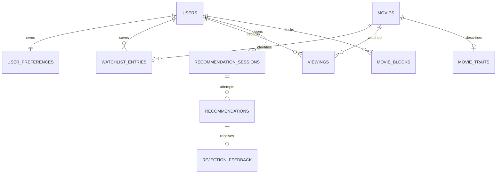

# Cinemé — initial PostgreSQL model

Version 1.1. SQLAlchemy 2/Alembic implements this model; this document is the schema contract, not migration code. All app tables use schema `cineme`. PostgreSQL 16 is the local baseline. UUID PKs generated in application except external identity/movie IDs. UTC `timestamptz` for instants; `date` only for local-day identity. JSON shapes are validated by Pydantic before persistence.

## Relationships

No generic event-sourcing table, separate user-rating table, actor table or per-request raw-prompt table. Rating belongs to the single known viewing; rejection belongs to its recommendation. Bounded comparison JSON is sufficient; there is no recommendation_scores table or full production input archive.

## Tables

### `users`

| Column | Type/default | Constraint/meaning |
|---|---|---|
| id | uuid | PK; verified Supabase `sub` |
| display_name | varchar(80), nullable | No email duplicated into app DB |
| timezone | varchar(64), `UTC` | Valid IANA zone checked in service |
| created_at / updated_at | timestamptz | Server UTC timestamps |
| onboarding_completed_at | timestamptz, nullable | Null while a new account still needs onboarding. Set once by `PATCH /me {onboarding_completed:true}` and never cleared or moved; migration 0007 backfilled every existing user to `created_at` (ADR 010) |

No FK to `auth.users`: same model works with local application DB and separately hosted Auth. Operator deletion workflow removes app user data then identity, with retry documentation.

### `user_preferences`

| Column | Type/default | Constraint/meaning |
|---|---|---|
| user_id | uuid | PK/FK users CASCADE |
| genre_preferences | jsonb, `{}` | TMDB genre ID string -> number [-1,1]; omitted = 0 |
| blocked_genre_ids | integer[], `{}` | Unique valid TMDB genre IDs |
| default_max_runtime_minutes | smallint, nullable | Inclusive cap, CHECK 1..600 |
| ai_context_enabled | boolean, false | Explicit opt-in |
| version | integer, 1 | CHECK >0; optimistic concurrency |
| updated_at | timestamptz | Last edit |

JSON avoids a table for at most roughly twenty genre scores. No learned preference materialization: recompute from one viewing record per film and its latest rating. Column-level JSON checks require object type; full key/range validation belongs to service/tests.

### `movies`

| Column | Type/default | Constraint/meaning |
|---|---|---|
| tmdb_id | bigint | PK; CHECK >0; V1 canonical movie identity |
| title / original_title | text | Required title, original nullable |
| release_date | date, nullable | Year derived; unknown stays null. Upcoming/unknown may be saved but are not Tonight-eligible (ADR 005) |
| runtime_minutes | smallint, nullable | CHECK null or 1..600; upstream 0 becomes null |
| genre_ids | integer[], `{}` | Distinct validated IDs |
| overview | text, nullable | Display-only, never scorer input |
| poster_path | text, nullable | TMDB-relative image path, validated |
| original_language | varchar(8), nullable | Metadata only in V1 |
| adult | boolean | Required; exclude adult films |
| vote_average | numeric(4,2), nullable | CHECK 0..10 |
| vote_count | integer, nullable | CHECK >=0 |
| metadata_status | text | `ready` or `unavailable` |
| fetched_at / created_at / updated_at | timestamptz | Freshness and cache audit |

Adult results may appear only as disabled search items and are never persisted. Upcoming and unknown-date films can be saved; eligibility is derived from `release_date` and the user's local date at ranking time, never stored as a flag (ADR 005). Existing cached movie can later be marked unavailable; exclude until explicit refresh fixes it. No stored full upstream JSON or credits in V1. Shared metadata is not user-private. Preserve movies while referenced by histories.

### `movie_traits`

| Column | Type | Meaning |
|---|---|---|
| movie_id | bigint | PK/FK movies CASCADE |
| pace / complexity / heaviness | numeric(4,3), nullable | CHECK 0..1 for each; null = unknown |
| source | text | `curated_v1` only in V1 |
| dataset_version | text | Version + content hash in snapshot |
| review_note | text | Short rationale, no copied review prose |
| reviewed_at | timestamptz | Human review provenance |

Optional enhancement only: introduce this table through an additive P6 migration only if enabling reviewed traits. The baseline starts with no table/dataset dependency and null traits. A small optional versioned JSON file can seed matching cached movies; missing rows/files mean unknown, not startup failure. No public editing API or generated values. Curated values are subjective judgments, not TMDB facts. All required functional gates must pass with zero enriched movies.

### `watchlist_entries`

| Column | Type | Meaning |
|---|---|---|
| id | uuid | PK |
| user_id / movie_id | uuid / bigint | FKs users CASCADE / movies RESTRICT |
| status | text, `active` | CHECK `active` or `removed` |
| added_at | timestamptz | Age starts here, reset on restoration |
| removed_at | timestamptz, nullable | Required only when removed |
| source_type | text, `manual` | V1 `manual`; reserved later `csv`, `letterboxd` |
| source_ref | varchar(256), nullable | Opaque import row reference; never auth cookie/secret |
| created_at / updated_at | timestamptz | Record lifecycle |

UNIQUE `(user_id,movie_id)`, including archived entries. CHECK status/removed_at consistency. At most 500 active rows is service-enforced under user lock. Do not delete rows when watched: archive them. Adding known-watched or blocked movie returns conflict, not a reset of history/block.

### `viewings`

| Column | Type | Meaning |
|---|---|---|
| id | uuid | PK |
| user_id / movie_id | uuid / bigint | FKs users CASCADE / movies RESTRICT |
| watched_at | timestamptz, nullable | Known completion time; null if date unknown |
| recorded_at | timestamptz | When account recorded evidence |
| source | text | `recommendation`, `manual`, `already_watched` |
| rating | smallint, nullable | CHECK 1..5; null means unrated |
| genre_ids_snapshot | integer[] | Frozen genres for learning/diversity |
| recommendation_id | uuid, nullable | FK recommendations SET NULL on delete; linked owned choice |
| version | integer, 1 | Optimistic rating edits; CHECK >0 |
| updated_at | timestamptz | Rating change |

Migration 0006 preserves existing data with the explicit mapping Disliked→1, Okay→3, Liked→4, Loved→5; null remains null. The downgrade maps 2 to Disliked because the legacy categories have no two-star value.

UNIQUE `(user_id,movie_id)`: V1 supports known watched state once, not rewatches. This cleanly prevents duplicate taste votes. Manual date can be unknown; if supplied it must not be in the future. Sort recent watched history using `COALESCE(watched_at,recorded_at)`. This proxy is labeled where date is unknown. Recommendation completion uses server now; already-watched feedback never claims today's completion.

### `movie_blocks`

`user_id uuid FK users CASCADE`, `movie_id bigint FK movies RESTRICT`, `created_at timestamptz`, `reason text = 'never_recommend'`. Composite PK `(user_id,movie_id)`. Deleting block unblocks but does not restore an archived watchlist entry. No automatic block from `disliked` rating.

### `recommendation_sessions`

| Column | Type | Meaning |
|---|---|---|
| id | uuid | PK |
| user_id | uuid | FK users CASCADE |
| local_date | date | UNIQUE `(user_id,local_date)` |
| timezone_snapshot | varchar(64) | IANA zone at first creation |
| day_ends_at | timestamptz | Next local midnight, handles DST |
| context | jsonb | Confirmed intent plus optional current_mood/time/advanced fields; API defines shape |
| version | integer, 1 | Increment on every session-visible mutation |
| current_recommendation_id | uuid, nullable | FK recommendations SET NULL on delete; current chosen/no-match result |
| completed_at | timestamptz, nullable | Today stops after actual linked completion |
| created_at / updated_at | timestamptz | UTC |

Session is a container, not a separate rating/context model. No state enum duplicating recommendation lifecycle. Response state derives from completion, pointer, rejection count and current recommendation status. Counts derive from bounded attempts; no fragile duplicate counter. The pointer/session circular FK is added after both tables in the migration, `DEFERRABLE INITIALLY DEFERRED`; insert session with null pointer first. Service checks the pointed record belongs to this session.

### `recommendations`

One row per recorded selection attempt, including no-match. Therefore the recommendation resource can have `movie_id=null`.

| Column | Type | Meaning |
|---|---|---|
| id | uuid | PK |
| session_id | uuid | FK sessions CASCADE |
| movie_id | bigint, nullable | FK movies RESTRICT |
| status | text | offered/accepted/rejected/watched/superseded/no_match |
| total_score | numeric(12,6), nullable | 0..100 when a movie selected |
| engine_version / config_version | text | Example `weighted_v1`, `weights_v1` |
| config_hash | char(64) | SHA-256 of exact canonical config_snapshot |
| config_snapshot | jsonb | Effective fixed weights/parameters/intent map |
| context_snapshot | jsonb | Requested/effective context, evaluation time, affinity/support and up to three watched genre sets |
| winner_snapshot | jsonb, nullable | Display metadata, retained scoring inputs/components/contributions; null on no_match |
| top_candidates | jsonb, `[]` | At most nine scored runners-up, ranks2..10; never actionable UI alternatives |
| exclusion_summary | jsonb | Candidate/eligible counts and exclusive primary exclusion counts for every attempt |
| comparisons_truncated | boolean, false | Size cap omitted trailing runner-up records |
| reason_data | jsonb | Saved approved reason codes, values and uncertainty |
| explanation | text | Deterministic short template result |
| no_match_summary | jsonb, nullable | Exclusive primary exclusion counts plus actions |
| created_at / accepted_at / resolved_at | timestamptz | Lifecycle |

CHECK selected rows have movie and score, no_match has neither. Status/time consistency checks as feasible. `accepted_at` is set once, remains historical if later rejected. `resolved_at` set for rejected/watched/superseded/no_match. Stored reasons/explanations never regenerate from changed metadata for an old run.

No-match is already terminal: clearing/replacing its current pointer never changes its status to superseded. Only selected offered/accepted rows transition to superseded. All active/terminal state transitions are listed below.

Partial UNIQUE `(session_id)` WHERE status IN ('offered','accepted') enforces at most one unresolved selected pick. Supersede old row before inserting new. Session can point at watched or no_match for display, but never rejected/superseded. A recommendation outside today's session is readable but cannot be accepted/rejected/watched through its old recommendation action.

### Bounded comparison storage (no separate table)

`winner_snapshot` stores one compact MovieSummary plus scoring inputs, raw Decimal-string components/contributions and total. `top_candidates` stores up to nine similarly compact eligible runners-up; JSON schema validates unique movie IDs/ranks, correct order and no duplicate winner. No individual excluded-film rows or inputs. Shared compact context/config live once on the recommendation. Global optional dataset hashes are unnecessary; retained known trait fields include source/review version, while unknown fields are null.

CHECK jsonb_typeof(top_candidates)='array' and jsonb_array_length(top_candidates)<=9. Selected rows require a winner snapshot whose movie ID matches movie_id; no_match requires null winner and empty comparisons. Service validates detailed JSON ownership/shape. Bound combined evidence to64KiB; drop only trailing comparisons and set flag if needed. The pure result over500 candidates lives in memory and full fixtures live in tests, never in this schema.

### `rejection_feedback`

`id uuid PK`, `recommendation_id uuid UNIQUE FK recommendations CASCADE`, `reason text`, `details jsonb`, `note varchar(500) nullable`, `created_at timestamptz`.

Reason enum matches PROJECT_SPEC. Details may contain a confirmed shorter cap, selected avoided genres, and/or resulting context effect. No independent user/movie foreign keys: derive them through owned recommendation to avoid mismatches. Rating is not stored here. On already-watched rejection, create/reuse viewing and archive watchlist in the same transaction. On never-recommend, create a persistent block without changing watchlist inventory. One rejected recommendation means one feedback row.

### `idempotency_records`

`id uuid PK`, `user_id uuid FK users CASCADE`, `key uuid`, `operation text` (method + route/resource), `request_hash char(64)`, `http_status smallint`, `response_body jsonb`, `created_at timestamptz`, `expires_at timestamptz`.

UNIQUE `(user_id,key)` across endpoints. Every private POST/PATCH/DELETE mutation requires an `Idempotency-Key` UUID, except POST me/bootstrap (naturally idempotent unique identity/transaction) and context/parse (read-like, no mutation). Introduce idempotency_records at P3 for real watchlist writes, not P2 bootstrap. Persist successful JSON response in the same transaction as the mutation. Matching replay returns the stored response even if the resource has since changed. Same key/different hash or operation: 409. Only successful committed mutations are cached. Expires after 24 hours; expired record can be replaced under user lock. Client creates one key per deliberate action and keeps it for transport retries.

Daily cleanup command deletes expired records; run before demo/release or daily operator maintenance. No queue/job service is required. Limit replay body size to normal endpoint responses; Today never includes runner-up comparisons.

## Indexes and constraints

- watchlist `(user_id,status,added_at DESC,id)`; active cap protected by user lock.
- viewings `(user_id,COALESCE(watched_at,recorded_at) DESC,id)` expression index for recent history.
- sessions unique `(user_id,local_date)` and `(user_id,created_at DESC)`.
- recommendations `(session_id,created_at DESC,id)`; `(movie_id,created_at DESC)` if needed for joins. Last offer queries must also scope through session owner.
- feedback unique recommendation; blocks composite key; idempotency expiry index.
- No GIN/full-text/vector indexes until a measured query requires them. Search is TMDB search, not local full-text.
- Private FKs cascade from deleted user/session; shared movie FKs restrict accidental metadata deletion.

## Bounded evidence and reproducibility contract

Retain engine/config versions, canonical config snapshot/hash, requested/effective context, fixed evaluation time, winner explanation/display/score evidence, exclusion summary and at most nine eligible runners-up. No raw prompts/notes/contact data/overviews/poster binaries inside ranking evidence. Complete deterministic fixtures live under tests; production evidence does not promise replay of the original full candidate set. A stored comparison check may recompute only retained scores and verify their relative order; it cannot certify discarded films.

Store Decimal inputs/components as canonical strings, score summaries six decimals, API display two decimals. Recompute with embedded config, not current weights. Optional known trait source/version is per retained movie. Preserve displayed winner metadata after cache updates. Never add per-candidate rows as a “debug feature” without explicit later scope approval.

## Atomicity and concurrency

All private mutations first lock `users` row, then owned session/resource. Freshness checks happen after lock; no network inside lock. This is intentional per-user serialization, not global serialization.

POST me/bootstrap handles concurrent first calls using insert-on-conflict for user/preferences in one transaction; GET me never inserts. Selection creates session only with confirmed desired experience, honors expected version, checks completion/current selection/pause and limits, then persists bounded evidence. User-approved context can be included in choose to apply+select atomically. Idempotency lookup happens under user lock before version checking, so a successful retry is replayed rather than rejected as stale.

Rating changes increment viewing version but do not change completed session or current choice. Recommendation-affecting preference edits increment preference and an uncompleted affected session's version, supersede offered/accepted choice and clear pointer. AI opt-in alone does not invalidate. Remove/block selected movie does the same. Adding another movie preserves offered/accepted choice, but clears a cached no-match pointer and increments session version. Effective scoring-context changes clear pointer after superseding any offered/accepted row; old no-match stays terminal. POST viewings for the selected movie supersedes the offered/accepted recommendation and clears pointer, recording newly known history without claiming tonight's completion. Manual viewings never complete Today. The separate already_watched rejection is a rejection, not completion either. Completed sessions retain their watched pointer across future preference/inventory changes and never reopen; rating edits affect the viewing only.

| From | Action | To / consequence |
|---|---|---|
| offered | accept | accepted, set accepted_at |
| offered or accepted | reject | rejected, feedback, clear pointer |
| offered or accepted | recommendation Mark watched | watched, viewing, session completed |
| offered or accepted | context/preferences/removal/manual-known-viewing invalidation | superseded, clear pointer |
| no_match | changed inputs or explicit retry | leave old row no_match; clear/replace pointer |
| rejected / watched / superseded | further mutation of that row | invalid transition (except stored idempotency replay) |

Daily action expiry checks that the target session is today's `(user_id,local_date)` under the current account timezone. `day_ends_at` is a frozen audit boundary, not a second conflicting authorization rule after a timezone edit. Same-date timezone edits reuse that day's session and its exclusions. Never reinterpret old timestamps or automatically reopen a completed session.

Reject with choose_another=true records feedback and ONE replacement in the same transaction and idempotency response. On the third/later rejection pause instead of auto-selecting, regardless of that flag. An explicit choose continuation uses continue_after_pause=true; genuinely changed effective scoring context versus the last attempted context also permits one intentional choice. Emotion-only metadata changes increment session version without clearing pick and never count as pause review. Already seen never records tonight completion or a rating unless supplied through later rating flow.

Same-user cross-resource ownership consistency (viewing/recommendation/session) is checked in services and integration tests; ORM FKs alone do not prove it. No client user_id parameters.

## Migration and seed policy

One reviewed Alembic migration per coherent schema change, reversible when feasible. Never `create_all()` as production migration strategy. Empty DB upgrade -> current -> downgrade -> upgrade smoke check in CI on a disposable database. Forward migrations preserve histories and snapshots.

Fixture movies and users exist only in explicit test/demo seeding, never automatic production startup. Demo metadata is fetched under legitimate API access; curated trait notes/values are repository-owned judgments. Offline synthetic fixtures do not include copyrighted overviews/poster binaries. Genre ID registry is versioned and validated against TMDB when integrated.

## Shows and anime (migration 0008, ADR 011)

All additive; film tables keep their meaning. TV ids live in their own tables because TMDB movie and TV ids overlap.

| Table | Key columns and rules |
|---|---|
| `series` | `tmdb_id` PK; `name`, `original_name`, `first_air_date`, `last_air_date`, `status`, `genre_ids int[]`, `poster_path` (relative, validated), `adult`, votes, `metadata_status`, `fetched_at`, `episodes_fetched_at`. Shared cache, no user data. |
| `series_episodes` | PK `(series_id, season_number, episode_number)`; `season_number >= 1` (specials are never stored); `air_date` and `runtime_minutes` (1..600) nullable = unknown. FK to `series` CASCADE. |
| `series_entries` | per user; UNIQUE `(user_id, series_id)`; `status active/removed` with `removed_at` consistency; `progress_season/progress_episode` both null or both set (>= 1); `progress_version`; `series_rating` 1..5. Removal archives and keeps progress. |
| `episode_viewings` | per user; UNIQUE `(user_id, series_id, season_number, episode_number)` (one watch per episode: idempotency and two devices); `source recommendation/manual/follow_up`; `rating` 1..5 (episode rating); `genre_ids_snapshot`; `version`. |
| `series_blocks` | PK `(user_id, series_id)`; reversible Never recommend. |
| `user_preferences.tonight_media` | `movies` (default) / `movies_and_shows` / `shows`; every existing row is `movies`. |
| `recommendations` | adds `media_kind` (`movie`/`episode`), `series_id`, `season_number`, `episode_number`; exactly one identity (`movie_id` or the episode triple) unless `no_match`; `total_score` range raised to 0..120 (episode scores add a bounded continuity bonus). The one-unresolved-pick index is unchanged. |

Lock order is unchanged: `users` row, then the owned session, then the show entry. No network call inside a lock.

## Additive migration schedule

- P2: users and user_preferences, plus idempotency_records for PATCH /me (ADR 003). Profile bootstrap, read, and display-name/timezone edits; preference editing arrives at P3/P4; no recommendation/history tables.
- P3: movies and watchlist_entries; their private mutations reuse the P2 idempotency ledger.
- P4: recommendation_sessions and recommendations with bounded JSON evidence; no candidate-score table; rejection_feedback brought forward for temporary reasons (ADR 006).
- P4 polish (migration 0004; ADR 006 amendment, ADR 007): viewings in the documented shape, written only by the already_watched rejection; `users.country_code varchar(2)` nullable (streaming region); `movies.watch_providers jsonb` + `watch_providers_fetched_at` (24 h shared availability cache).
- P5 (migration 0005): per-user `movie_blocks` plus durable follow-up prompted/resolved state on recommendations. Activates manual viewings and rating edits on the existing one-viewing-per-user/movie table.
- P6 ratings (migration 0006): converts legacy categories into nullable 1–5 integer ratings. This migration is local code only until separately applied; hosted database migration is not part of this change.
- Shows (migration 0008): `series`, `series_episodes`, `series_entries`, `episode_viewings`, `series_blocks`, `user_preferences.tonight_media`, and the episode identity on `recommendations` (see "Shows and anime"). Local code until separately applied to a hosted database.
- P6: optional movie_traits table only when deliberately enabling reviewed enrichment. Core ranking must also work without it.

Future-table queries do not run in earlier phases: recommendation scorer tests use typed fixtures; P4 history inputs are empty until P5 exists. Avoid placeholder database tables just to satisfy an import. Post-P5 migrations preserve real data.

For a combined reject+replacement command, increment session version once for the committed command; both feedback and the new attempt are in the same transaction. Other deliberate session mutations also increment once, unless identical/no-op.
